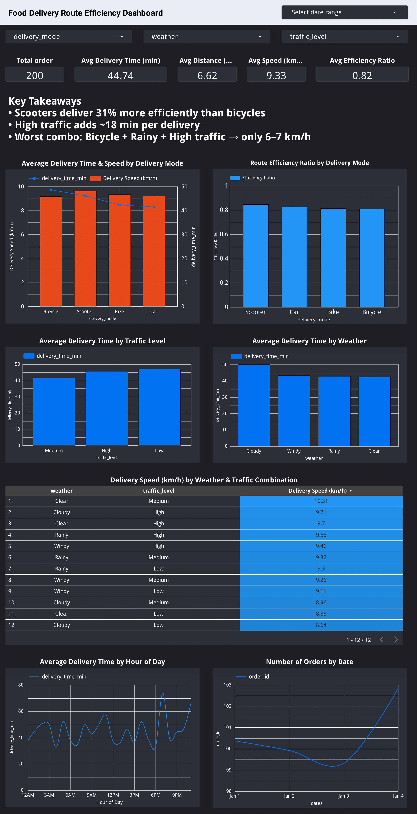
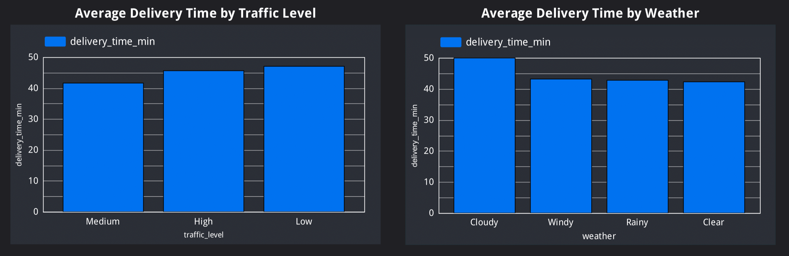

# Food Delivery Route Efficiency Dashboard 🚀

Live interactive dashboard → https://lookerstudio.google.com/reporting/c16b87cb-ca3a-46b6-a120-2c7a58ae6fa8 

### Key Insights
- Scooters are **31% more route-efficient** than bicycles
- High traffic adds **~18 minutes** per delivery on average  
- Worst performance: Bicycle + Rainy + High traffic → only **6–7 km/h**

### Tech Stack
- Google Looker Studio (free)
- Google Sheets as live data source
- Dataset: 200 real-world food delivery orders (Jan 2025)

### Screenshots

| Overview (Dark Mode)                        | Key Takeaways & Delivery Mode Deep-Dive                     |
|---------------------------------------------|-------------------------------------------------------------|
|  |                    |

| External Factors Impact                     | Time Patterns                                               |
|---------------------------------------------|-------------------------------------------------------------|
|  |                         |

### How to Run Your Own Version in 60 Seconds
1. Make a copy of the report → [Click here](https://lookerstudio.google.com/reporting/c16b87cb-ca3a-46b6-a120-2c7a58ae6fa8)  
2. Replace the Google Sheet with your own CSV (or keep the sample)  
3. Done — it auto-updates forever

Dataset → [Food_Delivery_Route_Efficiency_Dataset.csv](data/Food_Delivery_Route_Efficiency_Dataset.csv)

Built in <30 minutes with zero paid tools
